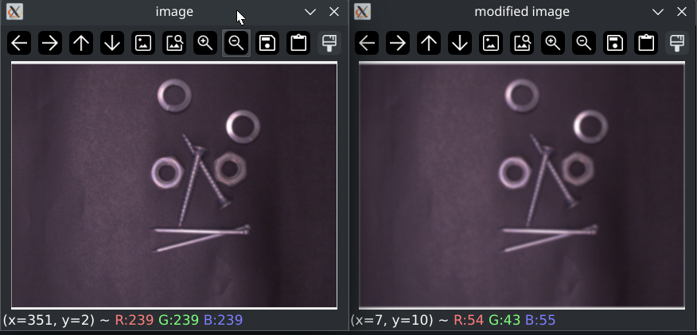
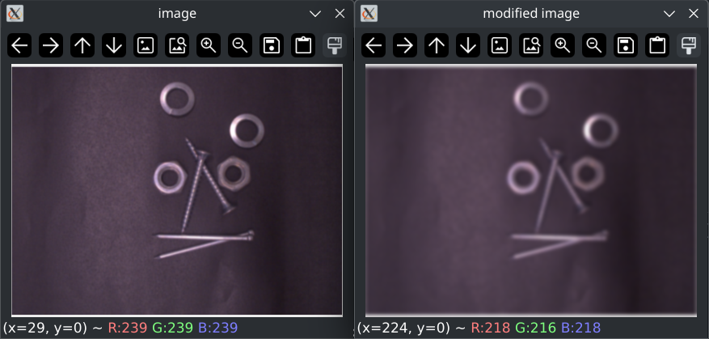
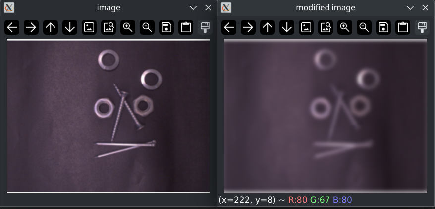
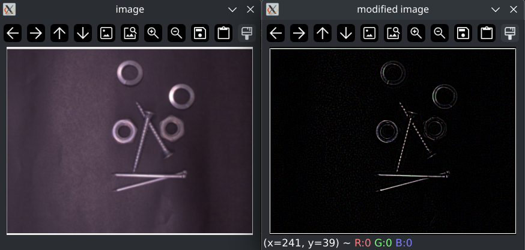
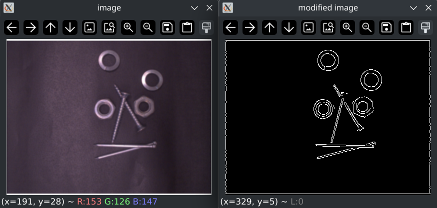
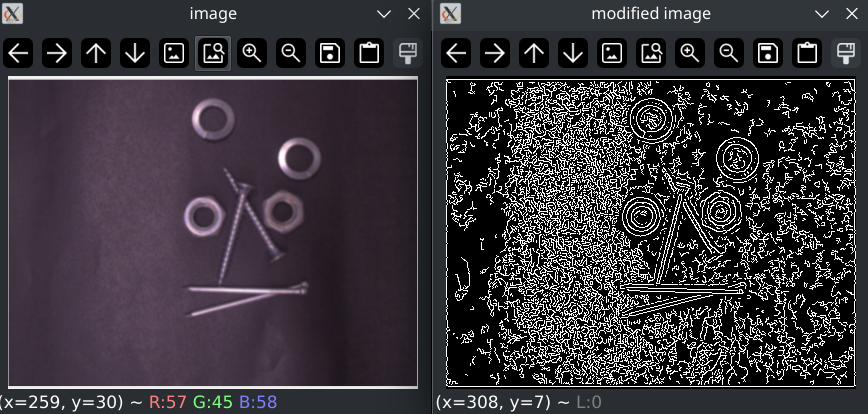
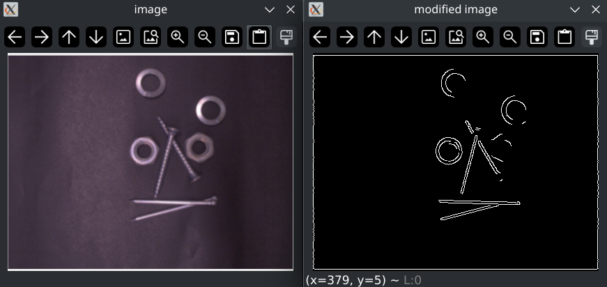

# Beeldbewerking

## Opdracht 1

3. Een van de ringen is voor het doorlaten van licht. Door deze te draaien kan er meer of minder licht naar binnen worden gelaten. De andere is voor het besturen van de zoom.

4. # Doe ik Later

6. 

## Opdracht 2

p.s. Het plaatje dat hier is gebruikt heb ik gekregen van iemand anders, doordat ik ziek was.

1. Aangezien ik bij afgelopen les ziek was en de vorige les mijn camera niet wilde werken heb ik geen beeld kunnen opnemen nog voor de deadline. Dit betekent ook dat op het moment ik een eigen script heb geschreven voor het inlezen van een afbeelding. Dus hier is mijn code met een afbeelding die ik van iemand anders heb gekregen:

5x5 kernel:

11x11 kernel:

23x23 kernel:

2. 

Die ene filter:

Canny (lower threshold 100, upper threshold 200): 

Canny (lower threshold 10, upper threshold 20): 

Canny (lower threshold 200, upper threshold 300): 

Het effect van de Canny parameters (de thresholds) is of een intensiviteits waarde (de manier waarop randen worden gevonden) wel of geen rand is. Met Canny specifiek is dit de lage Threshold, en de hoge threshold wordt gebruikt voor de meting of iets een sterke rand is.

3. # Doe ik Later

4. # Doe ik Later

## 5. Stappenplan

### Acquisitie 

In deze stap is het belangrijk om te zorgen dat de camera een opname te nemen in de maximale resolutie van de camera's (2592x1944) met een scherptediepte die de objecten die uiteindelijk herkent moeten worden in focus brengt. Hiervoor moet dus de diafragmaopening juist worden ingesteld. Dit mag alleen niet in de weg zitten van het verminderen van ruis. Een korte sluitertijd is niet van heel groot belang hier doordat de objecten die herkent moeten worden niet uit zichzelf kunnen bewegen.

De data die gebruikt wordt is RAW, kwaliteitsverlies door compressie is makkelijk te vermijden en maakt de latere stappen alleen maar lastiger.

### Enhancement

Om de objecten duidelijk te scheiden van de achtergrond wil ik eerst de afbeelding omzetten naar grijswaarden. Dit zorgt ervoor dat ik in segmentatie met thresholden de achtergrond kan scheiden van de voorgrond.

### Segmentatie

In deze stap wil ik aan de hand van thresholden de achtergrond zwart maken en de schroeven, bouten en moeren wit maken. Dit zorgt voor een goede scheiding van voor- en achtergrond.

### Feature Extraction

Hier wil ik met bounding boxes en cirkels de contour van het object krijgen waardoor ik de vorm van het object heb.

### Pattern Recognition / Classification

In deze stap wil ik het contour gebruiken om weer te geven welk object wat is. Zo kan ik bij een ring en moer controleren of er een gat in zit. En dan bij de moer nog controleren op de hoeken. Voor de spijker en schroef kan ik controleren op de bovenkant en of die naar buiten gaat of niet.

gain omhoog 
gamma max
rgb color space

bounding box:
Zijn beide zijden qua lengte zoveel procent van elkaar (delen door elkaar moet gelijk zijn aan bijna 1) dan is het een ring/moer,
zo niet spijker/schroef. Daarna kijken welke breder is (spijker of schroef) en dan heb je resultaat.