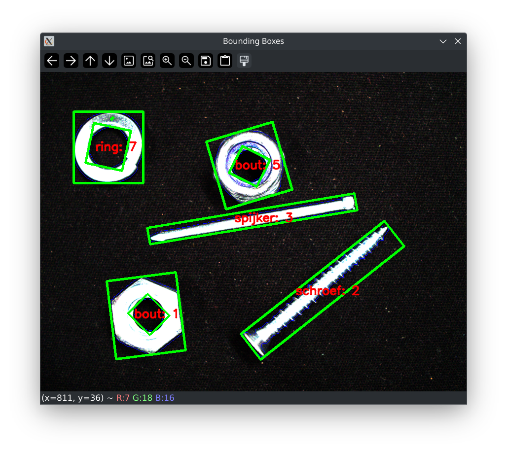

# Beeldbewerking

Dit document beschrijft de stappen die ik heb genomen om de bouten, ringen, schroeven en spijkers van elkaar te onderscheiden in het practicum van beeldbewerking.

## De stappen

### Stap 1: Acquisitie

In deze stap wordt zowel de hardware als de software van de camera zo samengesteld om het zo makkelijk mogelijk te maken om het gereedschap te splitsen van de achtergrond. Hiervoor was het belangrijk om een goede donkere achtergrond te gebruiken. Het beste dat ik hiervoor heb gevonden is een zwarte laptophoes. 

Hierna heb ik de camera scherpgesteld en de exposure, gamma en gain van de camera zo hoog mogelijk gezet. Dit is om de objecten zoveel mogelijk te scheiden van de achtergrond in deze eerste stap.

### Stap 2: Enhancement

In deze stap zet ik het beeld om naar grayscale en voeg ik een gaussian blur toe om het segmenteren zo makkelijk mogelijk te maken. De blur gebruikt een 7x7 kernel omdat dit het beste resultaat gaf tussen detail en het weghalen van gaten in de latere stappen.

### Stap 3: Segmentatie

Deze stap begint met een otsu threshold die het gereedschap scheidt van de achtergrond. Hierna wordt een kleine erosie gedaan met een 3x3 kernel en drie grote dilaties met een 9x9 kernel. Dit wordt zo gedaan om de bout met de blauwe ring goed weer te geven als één object.

### Stap 4: Feature Extraction

In deze stap vind ik de hoogte en breedte van alle objecten aan de hand van bounding boxes. Dit wordt gedaan met `cv2.findContours(dilation, cv2.RETR_TREE, cv2.CHAIN_APPROX_NONE)`. Deze hoogte en breedte worden gebruikt voor het bereken van de aspect ratio van een object.

### Stap 5: Pattern recognition

De pattern recognition begint met het scheiden van de schroeven/spijkers en de ringen/bouten. Dit wordt gedaan door het controleren of een bounding box een parent heeft, zo ja dan is het een ring/bout. Zo nee, als het geen child heeft dan is het een schroef/spijker.

Met het aspect ratio van de objecten die in de vorige stap zijn uitgerekend kan er worden onderscheiden of een object een schroef of een spijker is. Een aspect ratio van kleiner dan 0.1 is een spijker. Kleiner dan 0.4 is een schroef. 

Aspect ratio kan alleen niet gebruikt worden voor de ringen en bouten doordat deze allebei ongeveer hetzelfde aspect ratio hebben. Om deze reden gebruik ik daarvoor de area van de inner bounding box. De area van de bout is namelijk kleiner dan de area van de ring. Het nadeel aan deze techniek is wel dat als een camera op een andere afstand wordt gezet dan wanneer de waardes in de code worden gezet deze niet meer kloppen en aangepast moeten worden.

## Resultaat

Na al deze stappen ziet het uiteindelijke resultaat er als volgt uit:



## Code

```python
from pypylon import pylon # type: ignore
import cv2 # type: ignore
import time
import numpy as np

ring_of_moer_array = []
schroef_of_spijker_array = []

shouldSaveImage = False

# Print version string
print ("OpenCV version :  {0}".format(cv2.__version__))

# connecting to the first available camera
camera = pylon.InstantCamera(pylon.TlFactory.GetInstance().CreateFirstDevice())

#set the dimensions of the image to grab
camera.Open()
camera.Width.Value = 2592  # max width of Basler puA2500-14uc camera
camera.Height.Value = 1944 # max height of Basler puA2500-14uc camera


# camera.OffsetX.Value = 518
camera.AcquisitionFrameRate.SetValue(10) # 10 beelden per seconde

# set features of camera
camera.ExposureTime.Value = 20000
camera.ExposureAuto.SetValue('Off')
camera.BalanceWhiteAuto.SetValue('Continuous')
camera.LightSourcePreset.SetValue('Daylight6500K')
camera.GainAuto.SetValue('Off')
camera.GainRaw.Value = 127
camera.GammaRaw.Value = 2000
camera.PixelFormat = "RGB8"

print("Using device: ", camera.GetDeviceInfo().GetModelName())
print("width set: ",camera.Width.Value)
print("Height set: ",camera.Height.Value)

# The parameter MaxNumBuffer can be used to control the count of buffers
# allocated for grabbing. The default value of this parameter is 10.
camera.MaxNumBuffer = 5

# Grabing Continusely (video) with minimal delay
camera.StartGrabbing(pylon.GrabStrategy_LatestImageOnly)
converter = pylon.ImageFormatConverter()

# converting to opencv bgr format
converter.OutputPixelFormat = pylon.PixelType_BGR8packed
converter.OutputBitAlignment = pylon.OutputBitAlignment_MsbAligned

savingImage = False

while camera.IsGrabbing():
    grabResult = camera.RetrieveResult(5000, pylon.TimeoutHandling_ThrowException)

    if grabResult.GrabSucceeded():
        # Access the image data
        image = converter.Convert(grabResult)
        img = image.GetArray()

        if(savingImage == False and shouldSaveImage == True):
            cv2.imwrite('output_image.bmp', img)
            savingImage = True
        
        # Enhancement

        imS = cv2.resize(img, ((int)(camera.Width.Value/3),
                               (int)(camera.Height.Value/3)))
        cv2.namedWindow('camera', cv2.WINDOW_AUTOSIZE)
        cv2.imshow('camera', imS)
        gray = cv2.cvtColor(imS, cv2.COLOR_BGR2GRAY)
        cv2.imshow('grayscale', gray)
        blur = cv2.GaussianBlur(gray,(7,7),0)
        cv2.imshow('blur', blur)

        # Segmentation

        otsu_threshold, thresh = cv2.threshold(blur, 100, 255, cv2.THRESH_BINARY + cv2.THRESH_OTSU,)
        cv2.imshow('threshold', thresh)
        dilate_kernel = np.ones((9, 9), np.uint8)
        erode_kernel = np.ones((3, 3), np.uint8)
        erosion = cv2.erode(thresh, erode_kernel, iterations=1)
        dilation = cv2.dilate(erosion, dilate_kernel, iterations=3)
        cv2.imshow('dilated', dilation)

        # Feature Extraction

        frame = np.zeros(dilation.shape, dtype=np.uint8)
        # contours, _ = cv2.findContours(dilation, cv2.RETR_EXTERNAL, cv2.CHAIN_APPROX_SIMPLE)
        contours, hierarchy = cv2.findContours(dilation, cv2.RETR_TREE, cv2.CHAIN_APPROX_NONE)
        cv2.drawContours(imS, contours, -1, (255,0,0), 1)


        for i, h in enumerate(hierarchy[0]):
            if h[3] != -1:
               ring_of_moer_array.append(i)
            elif h[3] == -1 and h[2] == -1:
                schroef_of_spijker_array.append(i)

        # end Pattern recongition 1, continue with Feature extraction

        spijkerAmount = 0
        schroefAmount = 0
        ringAmount = 0
        moerAmount = 0

        # !!!!!! Didn´t work because it doesn´t work with objects that aren´t vertical or horizontal !!!!!!!!!!!!
        # for contour in contours:
        #     x, y, w, h = cv2.boundingRect(contour)
        #     cv2.rectangle(frame, (x, y), (x + w, y + h), (255, 255, 0), 3)

        for i, contour in enumerate(contours):
            # Get the rotated bounding box for each contour using minAreaRect
            rect = cv2.minAreaRect(contour)
            # Get the box points (vertices of the rotated rectangle)
            box = cv2.boxPoints(rect)
            # Convert the box points to integers
            box = np.int_(box)

            side1 = np.linalg.norm(box[0] - box[1])
            side2 = np.linalg.norm(box[1] - box[2])
            # print(f"box: {box}")
            cv2.drawContours(imS, [box], 0, (0,255,0), 3)

            x, y, w, h = cv2.boundingRect(contour)

            if side1 > side2:
                aspect_ratio = side2 / side1
            else:
                aspect_ratio = side1 / side2
            print(f"aspect ratio {i}: {aspect_ratio}")

            # Pattern Recognition

            text = None
            if i in ring_of_moer_array:
                area = cv2.contourArea(contour)
                if area > 2600:
                    text = f"ring: {i}"
                    ringAmount += 1
                elif area > 1000:
                    text = f"moer: {i}"
                    moerAmount += 1

                print(f"Contour {i} area: {area}")

            # Detect schroef en spijker
            elif i in schroef_of_spijker_array:
                # Spijker
                if aspect_ratio < 0.15:
                    spijkerAmount += 1
                    text = f"spijker: {i}"    
                # Schroef
                elif aspect_ratio < 0.4:
                    schroefAmount += 1
                    text = f"schroef: {i}"

            # Display text in center of rectangle around item.
            center_x = x + w // 2
            center_y = y + h // 2

            (text_width, text_height), baseline = cv2.getTextSize(text, cv2.FONT_HERSHEY_SIMPLEX, 0.5, 1)

            text_x = center_x - text_width // 2
            text_y = center_y + text_height // 2

            cv2.putText(imS, text, (text_x, text_y), cv2.FONT_HERSHEY_SIMPLEX, .8, (0, 0, 255), 2, cv2.LINE_AA)

        # Display the image with bounding boxes
        cv2.imshow('Bounding Boxes', imS)

        print(f"spijker amount: {spijkerAmount}")
        print(f"schroef amount: {schroefAmount}")
        print(f"moer amount: {moerAmount}")
        print(f"ring amount: {ringAmount}")

        ring_of_moer_array = []
        schroef_of_spijker_array = []


        # press esc (ascii 27) to exit
        k = cv2.waitKey(1)
        if k == 27:
            break
    grabResult.Release()

# Releasing the resource
camera.StopGrabbing()
cv2.destroyAllWindows()
```